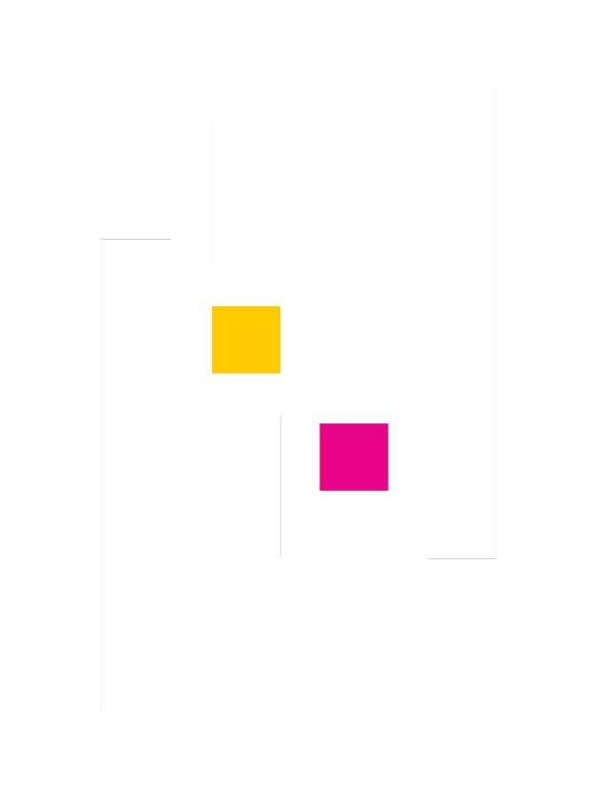
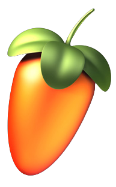

    

<h1 align="center">
    
  <!-- -->
</h1>
   
###    About Me:

  Hi, I'm Constantin Dragan, Computer Engineer & Software Developer from FRANCE
   
  👨‍🎓 I'm a student at <a href="https://www.efrei.fr/" target="_blank">EFREI Paris</a>
   
  🎹 I'm a musician and music composer.
   
  🥅 2023 Goals: Contribute to more soundtracks of indie games
   
  📚 I am currently focusing on video game creation and music composing.
   
  💭 I am a polyglote! I speak 4 languages at different levels:
   
     English &nbsp;-&nbsp;
     French &nbsp;-&nbsp;
     German &nbsp;-&nbsp;
     Romanian
   

<h2 align="center">📫 How to reach me 👇</h2> 

    
    
    
    
<!--      -->
<!--    -->

<h2 align="center" style="vertical-align:middle;">  Parallel Dream Studio </h2> 

    Parallel Dream Studio, co-founded by myself and <a href="https://github.com/Wedokia/">Maxime Cerruti</a>, also known as Wedokia, is a dynamic video game studio.
     
    Our mission is to provide a platform for students to explore their passion for game development while pursuing their studies.
      
    At Parallel Dream Studio, we strive to create a diverse range of video games, catering to different genres and scales.
     
    Our primary goal is to foster a creative environment that encourages students with artistic, engineering, and programming backgrounds to delve into the exciting realm of game creation.
      
    By combining our academic pursuits with our love for gaming, we aim to empower aspiring developers to unleash their creativity and develop practical skills.
     
    Parallel Dream Studio is dedicated to promoting a collaborative and enjoyable experience in the world of video game development.
     
    You can find out more on our company GitHub page : <a href="https://github.com/Parallel-Dream-Studio/">Parallel Dream Studio</a>
      

<h2 align="center">🔥 Languages & Frameworks & Tools & Abilities 🔥</h2> 

  
  </code>
  
  
  
  
  
  
<!--    -->
<!--    -->
  
  
  
  
  
  
  
  
  
  
  
  
  
  
<!--   <code></code> -->

<h2 align="center">⚡ Stats ⚡</h2>
 

<h2 align="center">💹 Most Popular Repos 💹</h2>
 

    

  

  

<!--

       

-->

  

